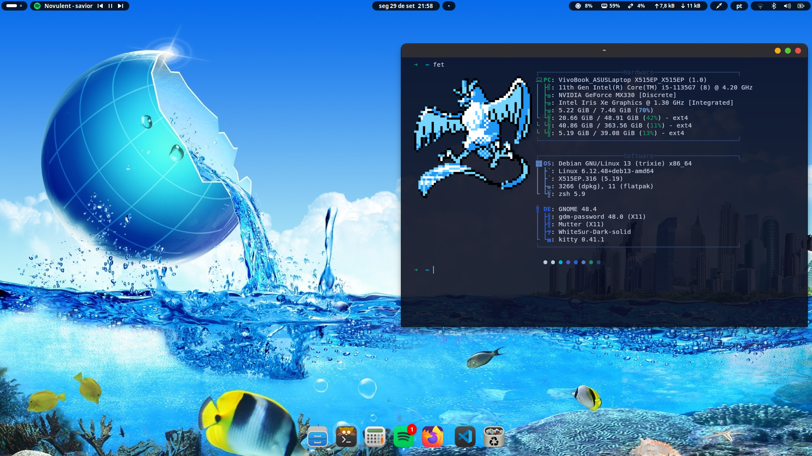
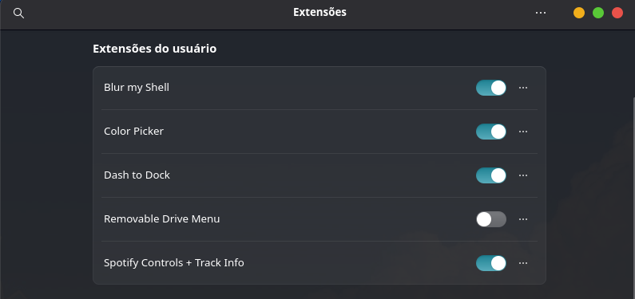

# Debian config 

---

Meu desktop Debian: 


Eu uso Debian gnome, mas os arquivos que estão nessa pasta se usa de modo geral, em quaisquer Ambiente de desktop

Extensões para o gnome - 
(Você pode encontrar em gnome-look.org ou extensions.gnome.org):
- Blur My Shell → adiciona desfoque elegante ao GNOME.
- Dash to Dock → transforma o dash padrão em dock customizável.
- Color Picker → seleciona cores direto da tela.
- Removable Drive Menu → acesso rápido a dispositivos removíveis.
- Spotify Controls + Track Info → controle do player no painel superior.


---

## Configuração de extensões
``` bash
sudo apt update && sudo apt upgrade -y

sudo apt install -y gnome-shell gnome-tweaks gnome-shell-extensions \ chrome-gnome-shell 
```
Nesse comando você atualiza o sistema para alguma dependência e após isso você instala o `gnome-tweaks / gnome-shell-extensions` onde você poderá utilizar suas extensões




**obs**: Uso apenas o Removable Drive Menu apenas para configuração de pendrive bootável (Backup) 
